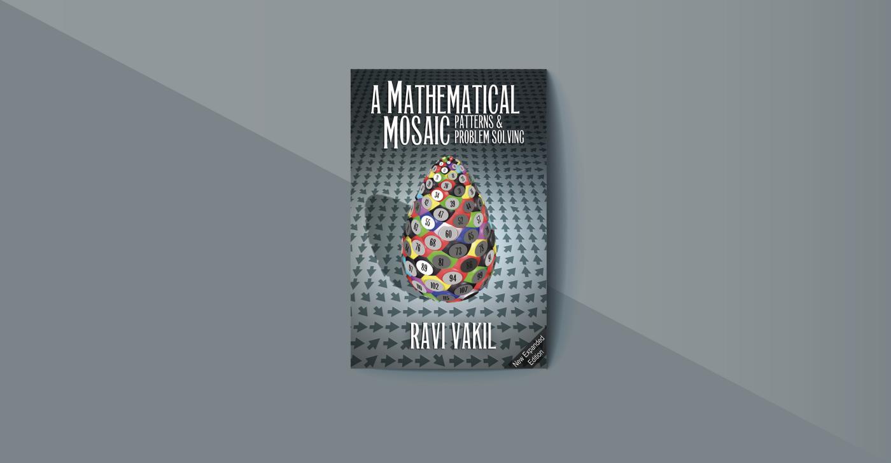
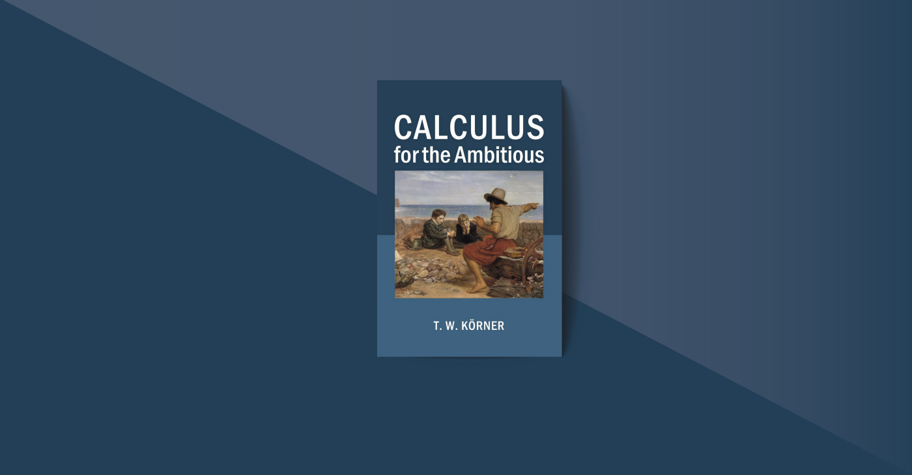
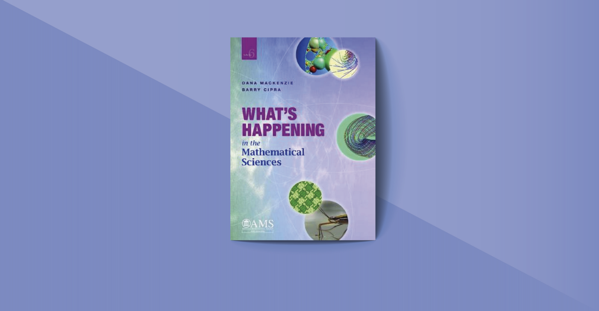

# A Mathematical Reading List For Lifelong Learners in 2022

Hazel Clementine

original link : https://mathladyhazel.medium.com/a-mathematical-reading-list-for-lifelong-learners-in-2022-4152fe1203ab

Photo by Erik Mclean on Unsplash

The number of mathematical books that are now available is staggering. Sometimes, you might feel obligated to read all those books, and I have decided to provide my favorite math and science books that you should discover to be beneficial to solve that issue.

Below, you will see 60+ pretty interesting math books that I believe anyone who enjoys mathematics should read them. I can guarantee that you will learn something new from each of the books in this collection. Because when I first this list, I told myself that I would finish all those books in two years. And I did and learned millions of things.

And I have some good news for you. Firstly, all those math books should be available in your local library, so you don’t need to pay for them. Secondly, since those math books are not textbooks, the Kindle versions are readable and reasonably priced.

Friends, Romans, countrymen! A new year is coming, and it is a good time to make plans for getting new and valuable habits for ourselves. I believe you should promise yourself and try to read these math books as much as possible in 2022.

## Solving Mathematical Problems by Terence Tao

Terence Tao is a winner of the Fields Medal. He calls this short book ‘a perspective,’ and he is right. Perhaps no one better suited to provide a personal viewpoint on problem-solving than he is. At the age of 13, he became the youngest gold medal winner in the history of the International Mathematical Olympiad. There are easy puzzles, challenging problems, and good insights sprinkled throughout the entire book. The problems are primarily geometric and algebraic, with some number theory thrown in for good measure.

Solving Mathematical Problems by Terence Tao — Check the reviews on Amazon

## How to Solve It by George Polya

This book is an old gem. This book, first published in 1945, is an excellent and ageless resource for anyone who wants to learn how to solve mathematical problems. Terry Tao, a Fields medalist, cites it as the book he learned what he knows today. The paperback edition has an engaging and entertaining foreword by Ian Stewart. And the Kindle edition has the introduction by John H. Conway. It is highly recommended.

How to Solve It by George Polya | Check the reviews on Amazon

## How to study for a maths degree by Lara Alcock

Although this sounds like the type of book that may be bad, it turns out to be quite extraordinary. There is no need to mention anything else because what is said on the cover perfectly describes what is contained within, and it’s worth looking at.

How to study for a maths degree by Lara Alcock | Check the reviews on Amazon

## How to Think like a Mathematician by Kevin Houston

This book has a wealth of excellent mathematics (including numerous engaging exercises) and intelligent suggestions. You would wonder how you could ever turn away from a reader whose first words like “How many months in a year have 28 days?”. The answer from a mathematician is all of them.

How to Think like a Mathematician by Kevin Houston — Check the reviews on Amazon

## Mathematicians: An Outer View of the Inner World by Mariana Cook

Another, the more modern way is to use a biographical narrative. A captivating and immediate introduction to some of the most outstanding mathematicians of our day, not only through a glimpse of their amazing mathematical work but also through their experiences as dads, daughters, spouses, and wives, is provided in this book. Each portrait is unique and written in the voice of the mathematicians who appear in it. You will learn what motivated them to pursue a career in mathematics, and you will no sure be motivated to engage in the excitement of mathematical discovery yourself.

Mathematicians: An Outer View of the Inner World by Mariana Cook — Check the reviews on Amazon

## A Russian Childhood by S. Kovalevskaya

After being appointed a professor at the University of Stockholm in 1889, Sonya Kovalevskaya made history by becoming the first woman in modern times to hold a lectureship at a European university. She did so even though she was a woman, a foreigner, a socialist, and an adherent to the newly developed Weierstrassian theory of analysis. Her childhood recollections are not only fascinating, but they are also non-mathematical. She discovered the idea of infinitesimals in her nursery, where the walls had been covered with pages of mathematical notes due to the difficult economic circumstances.

A Russian Childhood by S. Kovalevskaya | Check the reviews on Amazon

## Alan Turing, the Enigma by A. Hodges

This book is an excellent biography of Alan Turing, a pioneer of modern computers who lived during the twentieth century. In this case, the title has a double meaning: the guy himself was an enigma, and the Enigma machine generated the German code that he was vital in deciphering. Although the book is primarily non-mathematical, there are no bars barred when detailing his key achievement, which is now known as a Turing machine. He was able to demonstrate that a well-known conjecture of Hilbert was incorrect.

Alan Turing, the Enigma by A. Hodges | Check the reviews on Amazon

## A Mathematician’s Apology by G.H. Hardy

Hardy was a brilliant mathematician who lived during the first half of the twentieth century. He was a high achiever who was instrumental in bringing about a revival in mathematical analysis in England. Graham Greene was aware of no other piece of writing that conveyed the thrill of the creative artist as simply and with such a lack of fuss as this. C.P. Snow provides an introduction to the book.

A Mathematician’s Apology by G.H. Hardy | Check the reviews on Amazon

## The Man Who Loved Only Numbers by Paul Hoffman

Paul Erdos, one of the most prolific mathematicians, is profiled in this extraordinary biography. Erdos published approximately 1500 publications (about ten times the average number of papers published by a mathematician) and cooperated with 485 other mathematicians during his lifetime. With nowhere to call home, he just descended on colleagues with whom he desired to collaborate, transporting all of his stuff in a single suitcase. Apart from the specifics of Erdos’s life, there is a great deal of discussion about the problems.

## Surely You’re Joking, Mr Feynman by R.P. Feynman

One of the greatest theoretical physicists of the twentieth century shared autobiographical experiences in a book that became an instant best-seller. Science, life, and (the most perplexing of all) Feynman’s theories are all covered in this course. This is a very amusing and enjoyable book.

Surely You’re Joking, Mr Feynman by R.P. Feynman — Check the reviews on Amazon

## Fermat’s Last Theorem by Simon Singh

This story of Andrew Wiles’s demonstration of Fermat’s Last Theorem is a perennial favorite. He does an excellent job of describing some of the complicated mathematics at the heart of Andrew Wile’s proof while incorporating various mathematical ideas and anecdotes throughout the book. The majority of mathematics research, on the other hand, is not as compulsive and buried in secret as this particular investigation. Despite this, the book reads almost as if it were a thrilling thriller (with some amusing digressions) and expresses a genuine excitement for the wonders of mathematics.

Fermat’s Last Theorem by Simon Singh | Check the reviews on Amazon

## The Simpsons and Their Mathematical Secrets by Simon Singh

According to Simon Singh, “The Simpsons has many mathematical references.” The makers of this popular series (most of whom are mathematicians) demonstrate a genuine enthusiasm for mathematics throughout the series. Fans of The Simpsons and Futurama will have a lot of fun with this book.

The Simpsons and Their Mathematical Secrets by Simon Singh | Check the reviews on Amazon

## The Music of the Primes by Marcus du Sautoy

An extensive historical examination of a significant portion of mathematics is presented, with the Riemann Hypothesis serving as a common thread connecting all of the sections. The Riemann Hypothesis is considered one of the most challenging problems in mathematics. Although it is one of the Clay Institute’s million-dollar problems, it is unlikely to ever be the focus of a bar conversation, unlike Fermat’s final theorem. Du Sautoy’s book is intelligent and tastefully written. However, while some mathematics is challenging, the history and storytelling provide a compelling (and appealing) picture of the world of professional mathematics.

The Music of the Primes by Marcus du Sautoy — Check the reviews on Amazon

## Finding Moonshine: a mathematician’s journey through symmetry by Marcus Du Sautoy

This book has received overwhelmingly positive reviews (even better than Du Sautoy’s Music of the Primes mentioned above). The title is self-explanatory in its meaning. A journey through history sets the tone for the book, which concludes with some very contemporary concepts. You will even have the possibility of discovering a group named after you.

Finding Moonshine: a mathematician’s journey through symmetry by Marcus Du Sautoy

## Symmetry and the Beautiful Universe by Leon M. Lederman and Christopher T. Hill

To comprehend the physics principles that govern the Universe, it is necessary first to grasp the concept of symmetry. A significant accomplishment of this book is its ability to make some of the most sophisticated and profound topics in current physics understandable to a public readership while employing the least amount of mathematical equations possible. This book will take you from classical mechanics, including studies of inertia in the solar system and Newton’s laws, to Noether’s theorem and the relationship between symmetry and conservation laws, as well as to Einstein’s relativity, the standard model, and the Higgs boson. There are numerous original and fascinating stories and analogies interspersed throughout the tour. Highly recommended, albeit be wary with the Kindle edition, which contains numerous typos.

Symmetry and the Beautiful Universe by Leon M. Lederman and Christopher T. Hill | Check the reviews on Amazon

## Closing the Gap: The Quest to Understand Prime Numbers by Vicky Neale

Some well-known mathematical problems have the peculiar property of being extremely simple to state but highly complex to solve. Fermat’s final theorem, for example, is a good illustration. Another example is the twin prime conjecture, which is the subject of this book. According to this conjecture, there are many prime integers whose difference is equal to 2. As you may expect from the name, no proof has been discovered to date. Neale does an excellent job of guiding the reader through many attempts to get closer to proving the conjecture and teaching the fundamentals of number theory and cutting-edge mathematical notions in a manner that is both understandable and rigorous. In addition, the book has a large number of challenges that will force you to think, which is always entertaining and beneficial!

Closing the Gap: The Quest to Understand Prime Numbers by Vicky Neale — Check the reviews on Amazon

## Euler’s Pioneering Equation by Robin Wilson

Euler’s equation, e^iπ + 1 = 0, unites five of the most important integers in mathematics. It has been named the most beautiful mathematical theorem numerous times, including once as the most beautiful mathematical theorem globally. MRI scans have revealed that this elegant and deeply meaningful equation has the same effect on mathematicians’ brains as a piece of art! Robin Wilson investigates each of the numbers in turn, beginning with their historical mathematical evolution and concluding with the equation itself in the last chapter. Numerous methods of approximating, anecdotes, and “near misses” by renowned former mathematicians, applications, and proofs will all be covered in this book. This is a must-have for math enthusiasts, a book for the curious and engaging introduction to some fundamental mathematical notions.

## The Colossal Book of Mathematics by M. Gardner

Gardner’s work is worth about 700 pages for less than 20 pounds, which is an incredible value. If you haven’t seen it before (and most likely even if you have), the very first topic in the book will catch you in: a diophantine issue involving a monkey and some coconuts — I can’t say much more without giving too much away about the plot. In the book’s opening, there is a list of approximately 60 previous novels by Martin Gardner, none of which will disappoint.

The Colossal Book of Mathematics by M. Gardner | Check the reviews on Amazon

## Problem Solving Through Recreational Mathematics by Bonnie Averbach & Orin Chein

There are never enough math puzzles to go around! This is another excellent collection, ranging from easier problems to more difficult ones that will leave you perplexed, with enough variety to appeal to a wide range of interests while also introducing all of the major topics of mathematics. It is also entertaining to work your way through it, as there are several practice problems, suggestions, and solutions to most of the puzzles.

Problem Solving Through Recreational Mathematics by Bonnie Averbach & Orin Chein | Check the reviews on Amazon

## To Infinity and Beyond by Eli Maor

There isn’t much in this mathematically challenging book, but there is plenty of interesting mathematical ideas, a rich history, and lavish graphics. Princeton University Press has also published a book by the same author devoted entirely to a single number (e The Story of a Number) (1994).

Problem Solving Through Recreational Mathematics by Bonnie Averbach & Orin Chein | Check the reviews on Amazon

## Cakes, Custard and Category Theory: Easy recipes for understanding complex maths by Eugenia Cheng

This book is a must-read, entertaining, inventive, and brimming with contagious passion and unexpectedly mathematical recipes. The use of baking analogies may appear a little clumsy at times, but they are effective on the whole.

## The Norm Chronicles: Stories and numbers about danger by David Spiegelhalter and Michael Blastland

David Spiegelhalter is the Winton Professor for the Public Understanding of Risk at the University of Cambridge. He is an excellent presenter of mathematics: visit his website at https://understandinguncertainty.org/ for more information. A ‘guide to risk,’ the book is told through numbers and stories about the imaginary characters Norm and Prudence (both of whom are self-explanatory), as well as the irresponsible Kelvin. In this book, you will learn about the micromort (a chance of dying one in a million times), the micro life (30 minutes of life), and a slew of other fascinating facts and figures. For example, did you know that the radiation dose received while flying from London to New York is equivalent to the amount received by eating 700 bananas? The usual scare stories in the media will be viewed completely after reading this book, which will be both entertaining and educational!

The Norm Chronicles: Stories and numbers about danger by David Spiegelhalter and Michael Blastland | Check the reviews on Amazon

## A Mathematical Mosaic by Ravi Vakil

This book is a little out of the ordinary. It’s a magnificent collection of some of the most beautiful and exciting mathematical ideas and problems, ranging from Combinatorics to Game Theory, Geometry, Galois Theory, and much more, all of which are interwoven into a mosaic that demonstrates their relationship. Ravi Vakil has won several mathematical competitions and olympiads, and his problem-solving journey shapes his outlook. The writing style is friendly and enjoyable, and the mathematics is excellent. After stating that mathematics is an intensely social discipline, the author goes on to express gratitude to everyone who has shared their love of mathematics with him, particularly “the young men and women who agreed to share their unique perspective on the joys of mathematics for each of the seven profiles included in this book.” It is important not to be disheartened by the profiles of excellent young mathematicians — because they truly are remarkable!

A Mathematical Mosaic by Ravi Vakil — Check the reviews on Amazon

## The MαTH βOOK by Clifford A Pickover

There is a primarily non-mathematical exposition of one of the famous mathematical results on each left-hand page and an illustration of that result on the right-hand pages. Only enough mathematical detail is provided for you to comprehend the result and, if you so like, explore it further using Google. The book has been exquisitely created. Several hundred pages into Russell and Whitehead’s Principia Mathematica, which is considered the 23rd most influential non-fiction work of the twentieth century, is the postulate 1+1=2, which appears several hundred pages later on a page dedicated to Russell and Whitehead.

The MαTH βOOK by Clifford A Pickover — Check the reviews on Amazon

## Mathematics: a Very Short Introduction by Timothy Gowers

For someone who holds the Fields Medal (which is considered the mathematical equivalent of the Nobel Prize), it should be no surprise that what he writes is worthwhile to read. What is remarkable is the ease with which he writes and the elegance he communicates. He touches on a wide range of mathematical topics, which will be familiar to readers (Pythagoras, for example). In contrast, others will be unfamiliar (manifolds), and he has something interesting to say about each of them. The book is compact and thin, and it will easily fit in your pocket or backpack. It’s something you should get.

Mathematics: a very short introduction by Timothy Gowers — Check the reviews on Amazon

## Archimedes’ Revenge by P. Hoffman

This is not a hard book to read. Still, it does cover some extremely intriguing themes, such as why democracy is mathematically incorrect, Turing machines, and traveling salesman, among other things. Surprisingly, there is no chapter on chaos in this book.

Archimedes’ Revenge by P. Hoffman — Check the reviews on Amazon

## The Pleasures of Counting by T.W. Körner

This is an excellent book. There is something here for everyone interested in mathematics, and even the most erudite professional mathematicians will find something new to learn from this collection. Some chapters provide only a smattering of technical mathematics. In contrast, some situations necessitate the use of concepts learned in a first- or second-year undergraduate course. You may, however, skim over the technical details and still have a general understanding of what is going on. Enjoy the narrative of Braess’ paradox, the explanation of why we should all be given the name Smith and the story of how Enigma code-breaking was accomplished. The themes listed above are just a handful of Körner’s, many with amazing clarity and humor.

The Pleasures of Counting T.W. Körner — Check the reviews on Amazon

## Calculus for the Ambitious by T.W. Körner

You can and should use Korner’s most recent offering to augment your sixth-form calculus course. You will find some familiar ideas presented in unusual ways and very likely with a great deal of unfamiliarity. For example, multivariable calculus will be presented in a new light.

Calculus for the Ambitious by T.W. Körner— Check the reviews on Amazon

## Logical Labyrinths by Raymond S. Smullyan

An entertaining and engaging selection of logical problems, along with a rigorous mathematical introduction to logic, make up the content of this book. The meticulously graded and amusing evolution takes you from informal logical reasoning to more formal logical reasoning through a journey that is always tough enough yet manageable and gratifying at the same time.

Logical Labyrinths by Raymond S. Smullyan — Check the reviews on Amazon

## Luck, Logic, and White Lies: The Mathematics of Games by J¨org Bewersdorf

Discover (some of) the mathematics that underpins risk, uncertainty, and gambling. Dispel some commonly held beliefs and increase your chances of winning in games! Reading this book was a pleasure because it was practical and straightforward, and this is an excellent beginning.

Luck, Logic, and White Lies: The Mathematics of Games by J¨org Bewersdorf— Check the reviews on Amazon

## Insights into Game Theory: An Alternative Mathematical Experience by Ein-Ya Gura & Michael M. Maschler

The inspiration for this work came from Ein-Ya Gura’s Ph.D. dissertation. In this course, students will learn about Game Theory, which is the mathematical analysis of competing strategies, in a way that is accessible to those who have no prior knowledge of higher mathematics. Even though the book does not use formal mathematical notation, it provides rigorous proofs of some of the field’s most important results. Additionally, you can use the numerous exercises offered to aid in the consolidation of the material.

Insights into Game Theory: An Alternative Mathematical Experience by Ein-Ya Gura & Michael M. Maschler— Check the reviews on Amazon

## What is Mathematics? by R. Courant & H. Robbins

A new version of a classic, revised by Ian Stewart, is available. It contains chapters on numbers (including the symbol ), logic, cubics, duality, soap operas, and other topics. This book’s subtitle (An elementary approach to ideas and procedures) is a little too optimistic: difficult would be a more fitting description, though entertaining and educational would also suffice in this case. While Stewart has refrained from tampering with the book, he has updated it when necessary. For example, he discusses the solution to the four-color issue and the proof of Fermat’s Last Theorem where they are relevant.

What is Mathematics? by R. Courant & H. Robbins— Check the reviews on Amazon

## From Here to Infinity by Ian Stewart

As the author points out, this is a revised edition of Issues in Mathematics which was updated because of the author’s belief that some of the problems now have solutions, which is indicative of the rapidity with which the boundaries of mathematics are retreating. Solving the quintic, coloring, knots, infinitesimals, computability, and chaos are covered in this course. You are guaranteed to gain an understanding that mathematical study is more than merely producing new numbers, as stated in the preamble, and that you will gain a concept of what true mathematics is.

From Here to Infinity by Ian Stewart— Check the reviews on Amazon

## What’s Happening in the Mathematical Sciences by D. MacKenzie and B. Cipra

It is published by the American Mathematical Society, which is a wonderful resource. It features low(ish)-level discussions of some of the most significant recent discoveries in mathematics, as well as a large number of illustrations and photographs. Recent developments in mapmaking are covered in detail in Volumes 1 and 2, including map coloring, computer proofs, knot theory, traveling salesman, and other topics. There are articles about the proof of Fermat’s Last Theorem by Wiles, the examination of twin primes that resulted in the discovery of a fault in Intel’s PIII microprocessor, codes that depend on huge prime numbers, and the Enormous Theorem in group theory in Volume 3. In Volume 9, an article is published on the CERN experiment that confirmed that the Higgs Boson exists. Volume 10 of the series has now been completed. Members of the MAA are eligible for a discount. It’s really exciting.

What’s Happening in the Mathematical Sciences by D. MacKenzie and B. Cipra — Check the reviews on Amazon

## Beyond Numeracy by J. A. Paulos

Fractals, game theory, countability, convergence, and many other topics are covered in bite-sized articles. It is a sequel to Numeracy, which was similarly entertaining but less technical in its presentation.

Beyond Numeracy by J. A. Paulos — Check the reviews on Amazon

## 50 Visions of Mathematics by Sam Parc

To celebrate the Institute of Mathematics and its Applications’ 50th anniversary, this book contains 50 brief articles by various authors, each of which introduces some of the many applications of mathematics in a variety of fields while also providing brief biographies of some of the people who have changed our way of thinking about mathematics over the years. Mathematicians who made significant contributions in the twentieth century, as well as fun math and mathematical philosophy All of it is straightforward, interesting, and occasionally amusing, with equations kept to a bare minimum (but additional reading is recommended to follow up on areas where your curiosity has been sparked), and beautiful illustrations. References to ordinary life (such as how GPS satellites function, medical imaging, and many others) can be found alongside references to fictional characters (for example, in ‘The Simpsons rule’). An engaging and highly original article about Pythagora’s theorem, cutting-edge modern mathematics introduced in an accessible way, the mathematical explanation of the annoying traffic jams that occur for no apparent reason, even’ proof by a pizza’. After reading this book, you may want to reconsider your previous conceptions of applied mathematics.

50 Visions of Mathematics by Sam Parc— Check the reviews on Amazon

## Reaching for Infinity by S. Gibilisco

It was a quick and comfortable read about several types of infinity, even though it is mathematical. It also contains theorems, which are beneficial to your health. As an illustration, consider the equation 0 + 1 = 1. This is likely to necessitate some further explanation. In layman’s terms, the number of integers (which is the same as the number of rational numbers) is 0 (pronounced “aleph” zero), and the number of infinities beyond that is 1 (pronounced “aleph” one). There is another infinity, denoted by the symbol c = 20, representing the number of real numbers. However, the continuum hypothesis states that c = 1 wasn’t discovered until 1963 that this could not be proven or disproven until after the fact.

## The Mathematical Experience by P.J. Davis & R. Hersh

This provides an incredible foretaste of the thrill that comes with finding mathematics. This is a classic.

The Mathematical Experience by P.J. Davis & R. Hersh— Check the reviews on Amazon

## The Computational Beauty of Nature by Gary W Flake

Gödel’s Incompleteness theorem, cellular automata, genetic algorithms, and neural networks are some of the topics covered in this book, including Chaos and Fractals in their various forms. To begin with, it does not necessitate the use of any mathematics. Nonetheless, it presents sophisticated mathematical concepts from the ground up, with clear explanations and helpful examples, and reveals the exciting connections between these concepts and the world around them. You can have a lot of fun writing code and experiment with different topics utilizing the numerous pseudo-code examples provided. An excellent introduction to a wide range of fascinating situations, particularly to the use of computer experiments as a tool for exploring mathematical principles.

The Computational Beauty of Nature: Computer Explorations of Fractals, Chaos, Complex Systems, and Adaptation by Gary W Flake— Check the reviews on Amazon

## Chaos by J. Gleick

In interviews, candidates are occasionally asked if they have recently read any good mathematics books, which is a fair question. There was a moment when this candidate was named by nine out of ten candidates who stated an opinion. Could it be that they couldn’t all have been right? Nonetheless, this is a delightful introduction that focuses on the history of chaos theory.

Chaos by J. Gleick— Check the reviews on Amazon

## Chaos and Fractals: An Elementary Introduction by David P. Feldman

This is an enjoyable and extremely simple introduction to chaos and fractals that requires no mathematics beyond introductory algebra at the outset of the book. This method enables the author to guide you through basic notions to more complicated mathematical principles such as statistical stability, fractal Dimension, Lyapunov exponent, and chaotic flows in phase space without overwhelming you. The numerous activities aid in clarifying and understanding the vast array of mathematical concepts covered. This is not your typical textbook: the language is more like a discussion, with insightful viewpoints about the evolution of theories and bits of unusual facts about the mathematicians who developed them interspersed among the rigor of mathematics.

Chaos and Fractals: An Elementary Introduction by David P. Feldman— Check the reviews on Amazon

## Algorithms Unlocked by Thomas H. Cormen

What are algorithms, and why should you care? That is the question posed by this book. Mathematicians need to be concerned about this issue, given the widespread use of computers in mathematics and the overlap between what may be termed as “algorithmic thinking” and “mathematical thinking.” Donal Knuth published an article in The American Mathematical Monthly in which he examined precisely this overlap. He concluded that the overlap is nearly complete, except for two major concepts: “complexity,” which he defined as the economy of operation, and “dealing with infinite.” When it comes to problem-solving with computers and the underlying concepts of cryptography or the fundamental ideas of data compression, this book offers an exciting and readable introduction to both topics. It provides answers to a variety of intriguing topics, such as: “What does it mean to produce a correct solution to a problem?”

Algorithms Unlocked by Thomas H. Cormen— Check the reviews on Amazon

## A Short History of Nearly Everything by Bill Bryson

This one is for you for those who are more polymaths than pure mathematicians. The book describes the Universe and everything that exists inside it.

A Short History of Nearly Everything by Bill Bryson— Check the reviews on Amazon

## The Strangest Man: The Hidden Life of Paul Dirac by Graham Farmelo

Paul Dirac was a brilliant scientist who lived throughout the twentieth century. His work on combining quantum mechanics and special relativity resulted in the Dirac equation, which is often regarded as the most beautiful equation in all of physics. The man was almost as bizarre as his views about the Universe. In this fascinating biography, you may learn more about each of them. Special relativity, quantum mechanics, and the Dirac equation are taught in several courses throughout the Cambridge undergraduate degree program.

The Strangest Man: The Hidden Life of Paul Dirac by Graham Farmelo— Check the reviews on Amazon

## Black Hole Blues by Janna Levin

The collision of two black holes occurred in a galaxy long ago in the far distant past. The impact was so strong that it generated a breach in the spacetime continuum, which resulted in ripples in the spacetime continuum that we refer to as gravitational waves. These waves went unhindered across the Universe for 1.4 billion years before we were able to detect their presence on September 14, 2015. In the third year, you will learn about Einstein’s theory of general relativity and gravitational waves, which are both topics that will be covered in depth. Meanwhile, this book is a fantastic location to begin your research.

Black Hole Blues by Janna Levin— Check the reviews on Amazon

## The Particle at the End of the Universe by Sean Carroll

The elementary particle landscape hasn’t changed much since this fascinating study was published: it was published just in time to report the Z and W particles discovered at the same time. Indeed, it expresses well-founded doubt over claims of having observed the top quark. The final chapter establishes the critically crucial connection between particle physics and cosmology. To investigate the most recent batch of elementary particles, enormous amounts of energy must be expended; as a result, the Big Bang is the only practical “laboratory.”

The Particle at the End of the Universe by Sean Carroll— Check the reviews on Amazon

## Advanced Problems in Mathematics: Preparing for University by S.T.C. Siklos

It is advised as preparation for any undergraduate mathematics subject, even if the student does not intend to take the Sixth Term, Examination Paper. It comprises a collection of STEP–like tasks, each of which includes suggestions, discussion, and complete solutions. There is an excellent introduction to the book, which includes two wholly worked examples. The problems are distinct from other A-level questions, and they are substantially longer and sometimes contain material from seemingly unrelated areas of mathematics, such as algebra and geometry. They are more like the types of problems you would meet in a university mathematics course, despite being based on school mathematics curricula and textbooks. It would be beneficial to work through one or both of these booklets to get your maths back on track following the summer break.

Advanced Problems in Mathematics: Preparing for University by S.T.C. Siklos— Check the reviews on Amazon

## A Concise Introduction to Pure Mathematics by Martin Liebeck

This is really good work. Liebeck gives a straightforward, well-explained introduction to a wide range of concepts that would be found in any first-year mathematics course, including His methodical technique coming to an end before the reader becomes too mired down in the details. There are practical examples and exercises written in the same light tone as the book.

A Concise Introduction to Pure Mathematics by Martin Liebeck— Check the reviews on Amazon

> Note: As an Amazon Associate, I earn from qualifying purchases .
